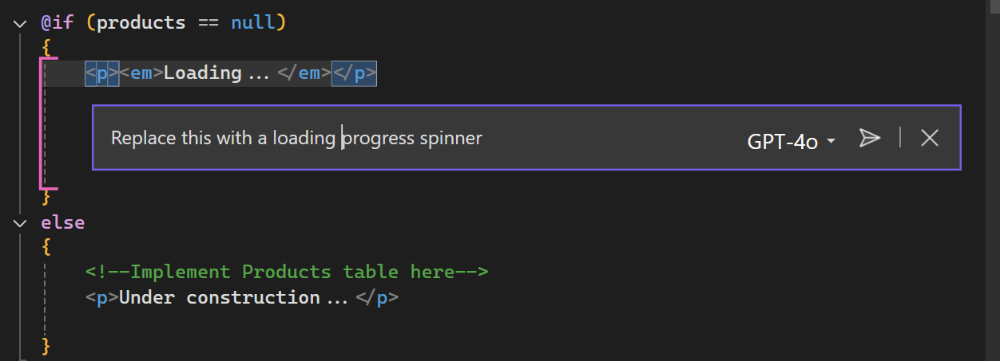

# Part 2: Enhancing UI with Inline Chat

Now, you'll improve the loading experience using Copilot's inline chat.

> [!NOTE]
> This exercise does supply specific prompts to type, but as part of the learning experience we encourage you to discover how to interact with Copilot. Feel free to talk in natural language, describing what you're looking for or need to accomplish.

1. [] Open **Products.razor** in the **Store** project under **Components**.
2. [] Find the "Loading..." text in the code.
3. [] Select this text and right-click.
4. [] Choose "Copilot > Start inline chat" or press `Alt+/`.
5. [] In the inline chat, type: "What would this look like with a loading progress spinner"

    

6. [] Preview the suggestion by clicking the "Preview" button.
7. [] Accept the change by clicking "Accept."

    ```html
    <div class="spinner-border text-primary" role="status">
        <span class="visually-hidden">Loading...</span>
    </div>
    ```
8. [] Run the application to see your new loading spinner in action.

**Key Takeaway**: Inline chat allows you to make targeted improvements to your code without leaving your editor context.
