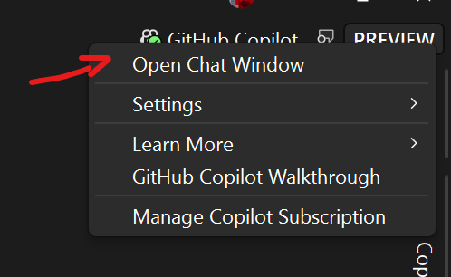
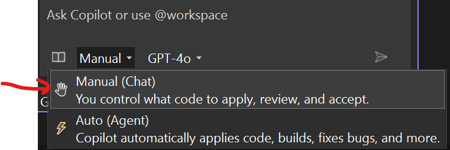
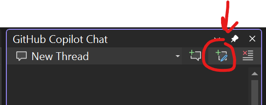

# Part 3: Referencing Code Files in Chat

In this section, you'll learn how to reference existing code files in your chat conversations.

1. [] Open the **Products.razor** again from the **Store** project.
1. [] Ensure that GitHub Copilto Chat is open by clicking on the Github Copilot Chat in the top-right corner of Visual Studio and select **Open Chat Window** or press `Ctrl+\+C` if Copilot chat isn't open.

   

1. Change the mode to `Ask`

	

1. Start a new chat by clicking the `+` icon in the top right corner of the chat window.

   

1. [] Type: `#ProductService.cs` to reference the ProductService file.
1. [] Ask: `How would I implement getting and visualizing the products in a table using the code in #ProductService and the css required.`
1. [] Review the code suggestion but don't implement it yet.
1. [] Notice how Copilot can reference existing code to provide contextual suggestions.

**Key Takeaway**: Referencing files in your chat provides Copilot with the context it needs to give more accurate, project-specific suggestions.
