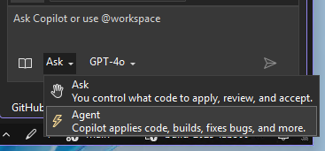
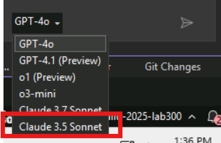

# Part 5: Implementing Features with Copilot Agent

Previously we utilized Copilot chat, which is great for working with an individual file or asking questions about our code. However, many updates necessitate changes to multiple files throughout a codebase. Even a seemingly basic change to a webpage likely requires updating HTML, CSS, Razor, and C# files. Copilot Agent allows you to modify multiple files at once across your project, self heals, and can run commands if granted permission like installing NuGet packages.

With Copilot Agent, you will add the files which need to be updated to the context. Once you provide the prompt, Copilot Agent will begin the updates across all files in the context. It also has the ability to create new files or add files to the context as it deems appropriate.

Let's add the ability to see a list of images into the app:

1. [] Open GitHub Copilot Chat in the top-right corner of Visual Studio and select **Open Chat Window** or press `Ctrl+\+C` if Copilot chat isn't open.

1. [] Switch to **Agent** mode.

   

1. [] In Visual Studio, open a new Copilot Chat with the **+** chat icon.

    

1. [] At the bottom of the GitHub Copilot Chat pane, select the model (default is GPT-4o") from the dropdown list, and select **Claude 3.5 Sonnet** from the list of available models.

    

1. [] Type: `Implement a product listing page in Products.razor that fetches products from #ProductService and displays them in a list with product name, description, price, and image.`

    > [!NOTE]
    > You should use your own phrasing when generating the prompt. As highlighted previously, part of the exercise is to become comfortable creating prompts for GitHub Copilot. One key tip is it's always good to provide more guidance to ensure you get the code you are looking for.

    > [!NOTE]
    > If you are asked to **Enable Claude 3.5 Sonnet for all clients** click on **Enable** button.

Copilot agent mode begins implementing the code suggestions!

## Reviewing the changes

Unlike our prior examples where we worked with an individual file, we're now working with changes across multiple files - and maybe multiple sections of multiple files. Fortunately, Copilot Agent has functionality to help streamline this process.

GitHub Copilot will propose the following changes to the application including updating the Products.razor and adding a Products.razor.css and maybe more.

1. [] Review the suggestions and click "Accept All" to implement the code.

    The code should look similar to the following:
    ```html
    <table class="table">
        <thead>
            <tr>
                <th>Image</th>
                <th>Name</th>
                <th>Description</th>
                <th>Price</th>
            </tr>
        </thead>
        <tbody>
            @foreach (var product in products)
            {
                <tr>
                    <td></td>
                    <td>@product.Name</td>
                    <td>@product.Description</td>
                    <td>@product.Price</td>
                </tr>
            }
        </tbody>
    </table>
    ```

    The **ProductService* should have been injected at the top of the file:
    ```html
    @inject ProductService ProductService
    ```

    The code should have been updated at the bottom of the file:
    ```cs
        @code {
        private List<Product>? products;
        private string imagePrefix = string.Empty;
    
        protected override async Task OnInitializedAsync()
        {
            // Simulate asynchronous loading to demonstrate streaming rendering
            await Task.Delay(500);
            imagePrefix = Configuration["ImagePrefix"]!;
            products = await ProductService.GetProducts();
        }
    }
    ```

1. [] Run the application to see your new product listing page.

1. [] Stop debugging and close the application

**Key Takeaway**: Copilot Agent can generate complete feature implementations based on your natural language descriptions, saving significant development time.
