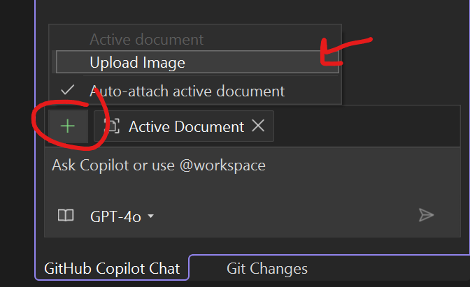

# Part 6: Using Copilot Vision

In this section, you'll use Copilot Vision. You can share screenshots of errors and Copilot will interpret the image and resolve the issue. Or share mockups of new designs, and Vision will help you bring them to life. Let's update our design based on a photo our design gave us.

1. [] Open a new Copilot Chat thread in Agent mode.
1. [] Click the **+** button in the chat, select **upload image**, and select the store application image that is found in the GitHub repo that is cloned called **eshop.png** inside of the `C:\Users\LabUser\Source\Repos\build-2025-lab300` directory.

    

1. [] Ask: `Update the Products.razor to display products in a grid layout similar to this image. Add nice hover effects and make it responsive.`
1. [] Review the suggested code changes and implement them. It should recommend changes to both the **Products.razor** and a new **Products.razor.css**
1. [] Run the application to see the updated product grid layout. You may have to clear the browser cashe with CTRL+SHIFT+R if you don't see the css update.

> Note: continue to iterate with Copilot Agent if it isn't to your liking.

**Key Takeaway**: Copilot Vision can understand UI designs from images and help you implement them in your application.
