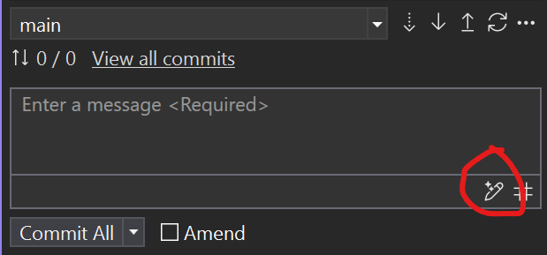

# Part 8: Commit Summary Descriptions

In this section, you'll learn how to use GitHub Copilot to generate commit messages and customize them.

1. [] Open the **Git Changes** view in Visual Studio (**View -> Git Changes**).
1. [] Select the sparkle emoji pencil button to automatically generate a commit message using Copilot.

   
   
1. [] Navigate to **Tools -> Options -> GitHub -> Copilot -> Source Control Integration**.
1. [] Update the commit message customization setting to: `Summarize in a few sentences and then highlight the top 5 changes with emoji and short descriptions`
1. [] Return to the **Git Changes** view and generate a new commit message.
1. [] Observe how the new commit message reflects the updated customization.

**Key Takeaway**: Copilot can help you create meaningful and well-structured commit messages, saving time and improving collaboration.

## Code Reviews with Copilot

1. [] Before submitting your changes, use the **Code Review** feature to analyze your code for potential improvements and suggestions.

   

1. [] Review the suggestions provided by Copilot and apply any necessary changes if there are any.

**Key Takeaway**: Copilot's Code Review feature can help you identify potential issues and improve code quality before submission.
