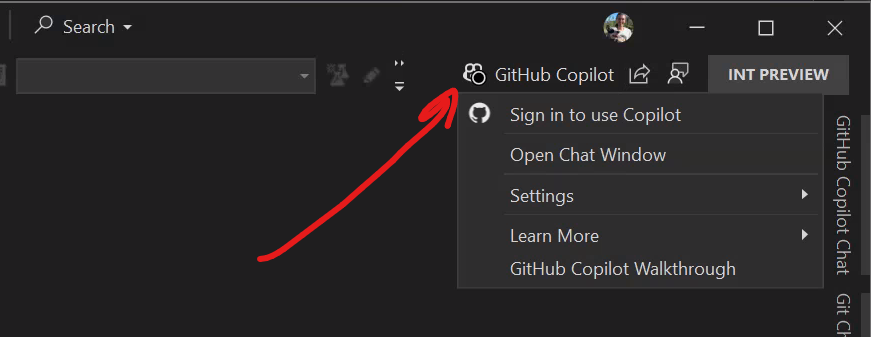

# Workshop setup

To complete this workshop you will need to clone a repository with a copy of the contents of this repository

> [!Hint]
> Under regular conditions you would need to ensure all prequirements, but don't worry. We have ensured this environment as all you need.

## Configure GitHub Copilot

> [!IMPORTANT]
> For your convenience we have the username and password on the instructions, but you can also see their values in the Resources tab

<!--For this lab you need a [GitHub account](https://docs.github.com/get-started/learning-about-github/types-of-github-accounts), if you don't have one no worries, you can create a personal account for free. Create your account in the [GitHub sign up page](https://github.com/signup).-->

1. [] Open **Edge** and go to `https://github.com/Microsoft-Build-2025`
2. [] Select **Continue** for Singe sign-on to **Skillable Events**
3. [] Enter +++@lab.CloudPortalCredential(User1).Username+++ on the Email, phone, or Skype input box and click on Next
4. [] Enter +++@lab.CloudPortalCredential(User1).Password+++ on the password field and click on Sign in with your entity provider button
5. [] Open Visual Studio 2022
6. [] Select **Continue without code**
7. [] Click on Copilot icon on top bar (left side next to the search input box)

8. [] Click on **Sign in to use Copilot** option
9. [] A browser will automatically open, you should already be signed in
10. [] Authorize the user by clicking continue and authorize VS Code access to user email by clicking on Authorize Visual-Studio* button
11. [] Click **open**  browser asks for the confirmation (**This site is trying to open Visual Studio.**)
12. [] After Copilot is setup you should now have a **Walkthrough: GitHub Copilot Chat** open tab in Visual Studio and the GitHub Copilot button should be green.

We are now ready to start working on our code with the help of Copilot.

## Clone lab repository

Let's clone the repository you'll use for the lab.

1. [] Click on **File -> Clone Repository** button
2. [] Type `https://github.com/dotnet-presentations/build-2025-lab300` and press **Clone**. 

The code is now opened in Visual Studio, feel free to take a look at it or skip to the next section to start the app.

## Start the app

1. [] Set the **TinyShop.AppHost** as the startup project and start the project with F5 or debug.

The .NET Aspire AppHost will start two applications and the .NET Aspire Dashboard:

- The backend .NET app on **https://localhost:7130**. 
- The frontend Blazor app on **http://localhost:7085**. You can see the app by opening that URL from the dashboard

## Summary and next steps

You've now cloned the repository you'll use for this workshop and have GitHub Copilot setup! Next let's **add a new endpoint to the server**
